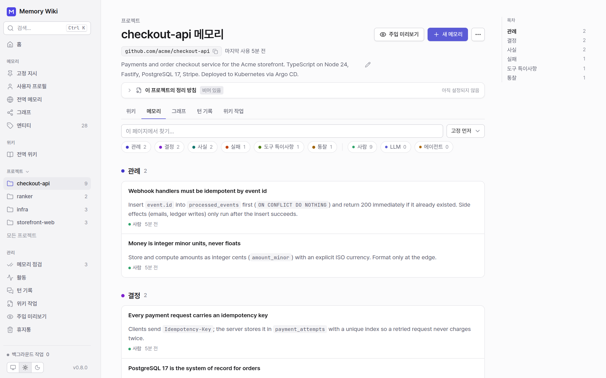
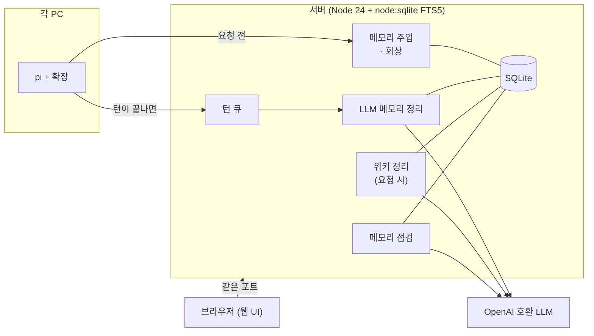
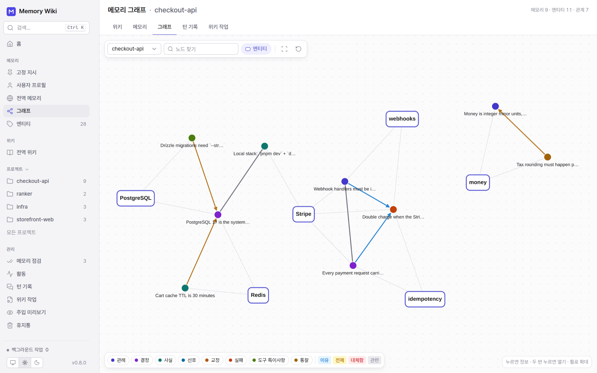
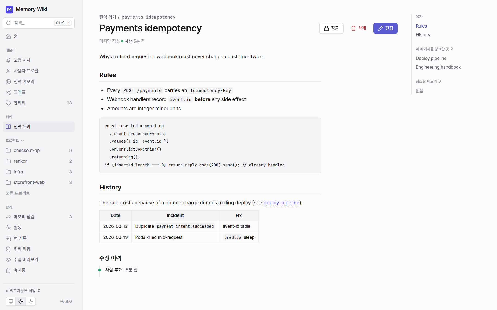
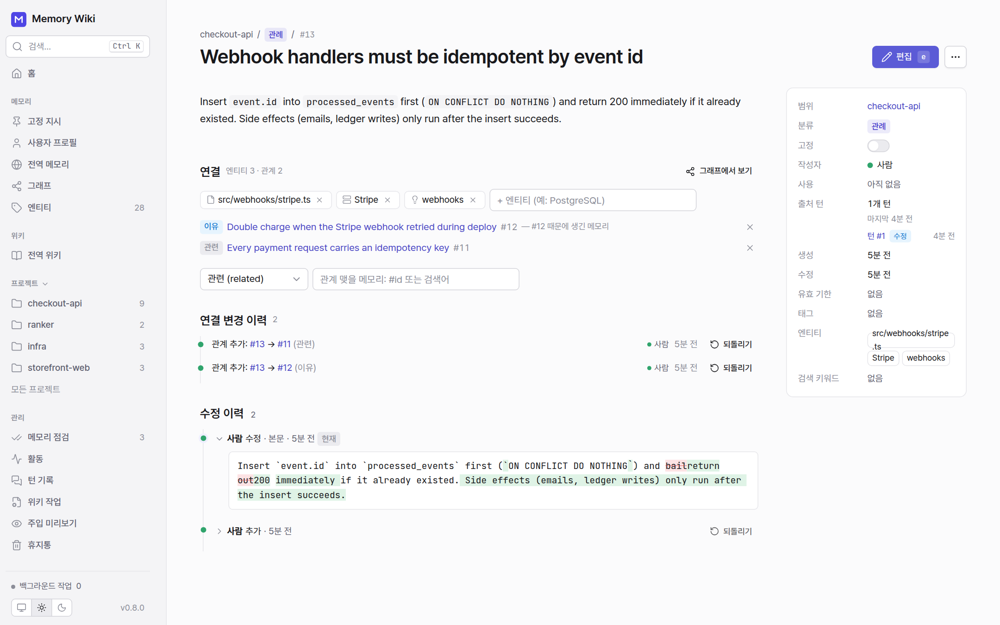
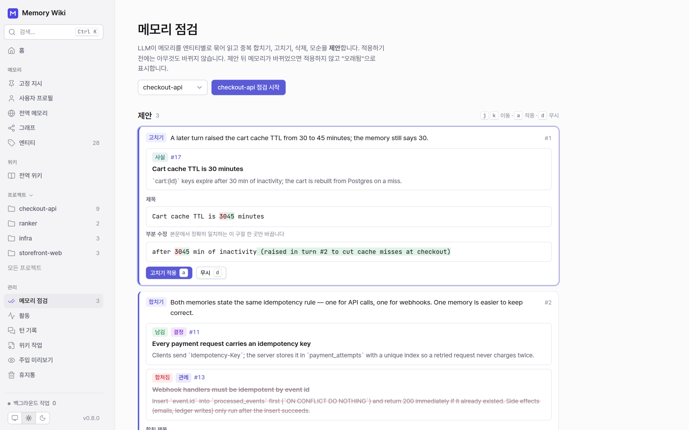
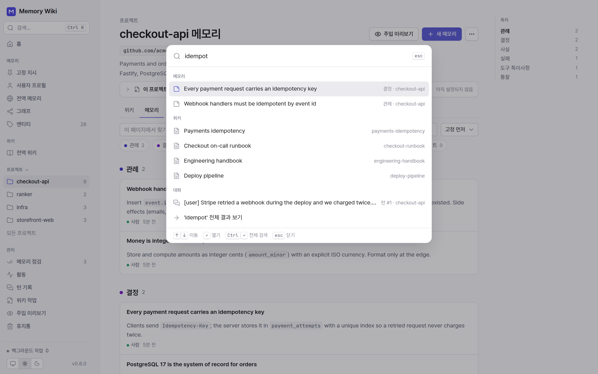

<div align="center">

# memory-wiki-all-you-need

**[pi](https://github.com/earendil-works/pi) 코딩 에이전트와 Claude Code를 위한 중앙 메모리 + LLM 위키 서버**

[](https://github.com/kht6163/memory-wiki-all-you-need/actions/workflows/ci.yml)
[](https://www.npmjs.com/package/pi-memory-wiki-all-you-need)
[](https://hub.docker.com/r/kht6163/memory-wiki-all-you-need)
[](LICENSE)

[English](README.md) | **한국어**

</div>

<picture>
  <source media="(prefers-color-scheme: dark)" srcset=".github/assets/screenshots/hero-dark.png">
  <source media="(prefers-color-scheme: light)" srcset=".github/assets/screenshots/hero-light.png">
  
</picture>

## 무엇인가요?

pi의 메모리를 PC마다 따로 두지 않고 **서버 한 곳**에 모읍니다. 확장은 요청할 때마다 메모리를 시스템 프롬프트에 넣습니다. 에이전트가 필요할 때 찾아보는 방식이 아니라 항상 들어갑니다. 턴이 끝나면 서버의 LLM이 대화를 읽고 메모리를 알아서 추가·수정·삭제합니다. 메모리와 별도로 **위키**도 있습니다. 사람과 에이전트가 함께 쓰는 문서 공간이고, 요청하면 서버 LLM이 턴 기록을 읽어 페이지로 정리해 줍니다.

## 동작 방식



## 기능

**메모리**
- **강제 주입** — 정책, 고정 지시, 사용자 프로필, 프로젝트·전역 메모리 순으로 `CONTEXT_BUDGET_CHARS` 안에서 넣습니다. 메모리가 바뀔 때만 내용이 바뀌므로 프롬프트 캐시가 유지됩니다.
- **프롬프트별 회상** — 이번 프롬프트와 관련된 나머지 메모리는 `memory-recall` 메시지로 붙고, 화면에는 `memory_recall` 카드로 보입니다. 턴이 정리되어 메모리가 바뀌면 `memory_curate` 카드가 붙습니다(`showActivity`).
- **턴 정리** — LLM이 관련 기존 메모리를 함께 보고 add / update / edit / delete / confirm을 정합니다. 모든 변경은 이력에 남아 되돌릴 수 있고, 똑같은 메모리는 다시 추가하지 않습니다.
- **정확한 날짜** — "어제"는 정리한 날이 아니라 턴이 일어난 날(`TIMEZONE` 기준)로 적습니다. 메모리마다 어느 턴에서 추가·수정·확인됐는지도 남습니다.
- **지난 사실** — 새 메모리가 옛 메모리를 `supersedes`로 대체하고, 임시 사실은 `valid_until`이 지나면 이력으로 넘어갑니다. 이력은 주입되지 않지만 검색할 수 있습니다.
- **의미 검색(선택)** — 임베딩 서버(예: [infinity](https://github.com/michaelfeil/infinity) + `BAAI/bge-m3`)를 붙이면 메모리와 위키를 뜻으로도, 언어가 달라도 찾습니다. 한국어로 물어도 영어 메모리가 나옵니다. 키워드 검색은 그대로 함께 쓰고 두 순위를 합칩니다. 임베딩 서버가 죽거나 느리면 키워드 검색으로 돌아갑니다.
- **검색 키워드** — 동의어·번역·다른 표기(`Postgres`, `포스트그레스`)는 검색과 회상에만 쓰이고 프롬프트에는 들어가지 않습니다.
- **정리 방침** — 서버 LLM이 따를 규칙을 전역·프로젝트별로 사람이 적어 둡니다.
- **프로젝트 구분** — git `origin` 주소를 정규화해 씁니다(`github.com/foo/bar`, worktree는 메인 저장소 기준). 원격이 없으면 `local/<폴더명>`. git 밖이면 전역으로 보내지 않고 그 폴더를 프로젝트로 씁니다: 홈 디렉터리(`~`)는 `home/<사용자명>`, 그 아래 폴더는 `home/<사용자명>/<경로>`, 그 밖은 `path/<절대 경로>`. 설정 파일의 `project`(또는 `MEMORY_PROJECT`)로 직접 지정할 수 있습니다.

**그래프**
- **엔티티와 관계** — 메모리는 엔티티를 언급하고 `because`·`depends_on`·`supersedes`·`related`로 서로 이어집니다. 턴 정리와 같은 호출에서 정하므로 LLM을 더 부르지 않습니다. 엔티티는 프로젝트끼리 공유되고, 이름을 바꾸거나 합치면 예전 이름이 별칭으로 남습니다.
- **그래프 회상** — 프롬프트가 언급한 엔티티의 메모리를 앞으로 올리고, 이웃 메모리를 `GRAPH_RECALL_EXTRA`개까지 더합니다.
- **비슷한 엔티티 제안** — 이름 유사도와 함께 언급된 정도로 "PostgreSQL ↔ Postgres" 같은 합치기를 제안합니다(LLM 없음).

**점검**
- **메모리 점검** — LLM이 같은 엔티티의 메모리끼리 묶어 읽고 합치기·고치기·삭제·모순을 *제안*합니다. 사람이 적용하기 전에는 아무것도 바뀌지 않고, 그사이 메모리가 바뀌었으면 적용하지 않습니다.
- **예약 점검** — `REVIEW_EVERY_DAYS`를 켜면 바뀐 범위를 주기적으로 점검해 제안만 쌓습니다.
- **사용 기록** — 최근에 쓰인 메모리를 앞에 둡니다(전날까지의 사용만 반영해 하루 동안 순서가 고정됩니다). 오래 안 쓰인 메모리는 따로 보여 줍니다.

**위키**
- **프로젝트별·전역 위키** — `[[slug]]` 링크, `[#id]` 메모리 참조, 이력·되돌리기·백링크·검색·잠금을 지원합니다.
- **페이지 트리** — 페이지를 다른 페이지 아래에 둡니다. 접고 펴는 트리, 경로, 페이지 트리 레일을 보여 주고, 평평한 위키에는 묶음 제안(예: ADR들을 목록 페이지 아래로)을 띄웁니다. 적용하기 전에는 아무것도 바뀌지 않습니다.
- **턴 기록으로 정리** — LLM이 대화와 도구 실행 결과를 읽어 페이지에 반영합니다. `WIKI_COMPOSE_CHUNK_CHARS` 단위로 나눠 처리하며, 자동으로는 돌지 않습니다. 웹 설정(`#/settings`)이나 `WIKI_COMPOSE=0`으로 끌 수 있고, 꺼도 에이전트와 사람은 페이지를 직접 씁니다.
- **위키 점검** — 고아 페이지, 없는 페이지 링크, 지워진 메모리 인용, 빈 페이지를 찾습니다(LLM 없음).
- **스킬** — 배포·릴리스·검토 순서 같은 반복 절차를 웹에서 전역 또는 프로젝트별로 씁니다. 각 PC는 pi가 시작할 때와 `/skills-sync` 명령으로 서버에서 한 방향으로 내려받아 `~/.pi/agent/extensions/memory-wiki-all-you-need/skills/`에 둡니다(전역·프로젝트 폴더 분리). pi는 이름과 설명을 보고 작업이 맞을 때 본문을 읽습니다. 같은 이름이면 프로젝트 스킬이 전역 스킬을 대신합니다. PC에서 고친 내용은 다음 동기화 때 덮어쓰고, PC의 파일은 서버로 올리지 않습니다. 에이전트도 `skill_manage`(pi-hermes-memory와 같은 이름)로 직접 스킬을 남깁니다. 시행착오가 있었거나 도구를 많이 쓴 작업을 마치면 서버에 스킬을 만들거나 고치고, 그 결과가 다시 PC로 내려옵니다. 에이전트는 스킬을 지울 수 없고, 고치려면 먼저 현재 내용을 읽어야 합니다. 서버의 스킬이 바뀌면 다음 요청 때 pi가 `/skills-sync`를 하라고 알려 줍니다. 모든 수정은 이력에 남아 되돌릴 수 있고, 지운 스킬은 휴지통으로 가며, 잠근 스킬은 사람만 고칠 수 있습니다. 기본으로 에이전트가 만든 전역 스킬(또는 승인된 전역 스킬의 수정)은 웹에서 승인해야 PC로 내려갑니다. 설정 화면 "에이전트 스킬 승인"에서 안 함 / 전역 스킬만 / 모두를 고릅니다.

**웹 UI**
- 라이트·다크 테마, `⌘K` / `Ctrl K` 명령 팔레트(초성 검색 포함), 키보드 단축키(`?`), 되돌리기 토스트, 모바일 서랍 메뉴. 글꼴이 포함돼 있어 외부 CDN을 쓰지 않습니다.

**보호**
- **비밀값** — 비밀값처럼 보이는 내용은 저장을 거부하고, 턴 기록에서는 가립니다.
- **사람 전용** — 고정 지시와 정리 방침은 사람만 쓰고 고칠 수 있습니다.
- **fail-soft** — 서버가 꺼져 있거나 느려도 짧은 타임아웃(`MEMORY_TIMEOUT_MS`) 뒤 pi 턴이 그대로 진행되고, 마지막으로 받은 메모리 블록을 다시 씁니다.
- **디버그 모드** — 웹(또는 `DEBUG_MODE=1`)에서 켜면 `data/logs/`에 날짜별 JSON-lines 파일로 모읍니다. 요청, 회상이 메모리를 고른 이유(키워드 점수·유사도·그래프 경로), 검색, LLM 프롬프트와 응답, 턴 정리 결과, 임베딩 호출이 남습니다. 비밀값 형태는 가리고, 14일 보관·하루 최대 200MB입니다.
- **작업 취소** — 위키 정리·그래프 백필·점검 작업은 취소했다가 이어서 다시 실행할 수 있습니다.

## 스크린샷

<table>
  <tr>
    <td width="50%"><br><sub><b>그래프</b> — 프로젝트별 엔티티와 메모리 관계</sub></td>
    <td width="50%"><br><sub><b>위키</b> — 이력과 백링크가 있는 페이지</sub></td>
  </tr>
  <tr>
    <td width="50%"><br><sub><b>메모리</b> — 엔티티·관계·출처 턴, 수정 이력 비교와 되돌리기</sub></td>
    <td width="50%"><br><sub><b>점검</b> — LLM 제안과 변경 비교, 적용 전에는 아무것도 바뀌지 않음</sub></td>
  </tr>
  <tr>
    <td width="50%"><br><sub><b>명령 팔레트</b> — <code>⌘K</code> / <code>Ctrl K</code>로 메모리·위키·지난 턴 검색</sub></td>
    <td width="50%"></td>
  </tr>
</table>

## 빠른 시작

### 1. 서버 실행

서버 이미지는 [도커 허브](https://hub.docker.com/r/kht6163/memory-wiki-all-you-need)에 `linux/amd64`·`linux/arm64`로 있습니다. 태그는 `X.Y.Z`(그 버전), `X.Y`(그 minor의 최신 패치, 예: `0.14`), `latest`입니다.

Docker Compose 예시입니다(`LLM_API_KEY`는 `.env`에 둡니다).

```yaml
services:
  memory:
    image: kht6163/memory-wiki-all-you-need:0.18   # amd64 / arm64
    restart: unless-stopped
    environment:
      LLM_BASE_URL: http://<llm-host>:8317/v1
      LLM_API_KEY: ${LLM_API_KEY:?missing}
      LLM_MODEL: gpt-6-luna
      TIMEZONE: Asia/Seoul
    ports:
      - "127.0.0.1:8765:8765"
    volumes:
      - ./data:/data
```

컨테이너는 `node` 사용자(uid 1000)로 돌기 때문에 `./data`에 쓸 수 있어야 합니다: `mkdir -p data && sudo chown 1000:1000 data`.

`docker run`으로 바로 띄울 수도 있습니다.

```sh
mkdir -p data && sudo chown 1000:1000 data
docker run -d --name memory-wiki --restart unless-stopped \
  -p 127.0.0.1:8765:8765 -v "$PWD/data:/data" \
  -e LLM_BASE_URL=http://<llm-host>:8317/v1 -e LLM_API_KEY=<키> -e TIMEZONE=Asia/Seoul \
  kht6163/memory-wiki-all-you-need:0.18
```

**선택: 의미 검색.** 같은 compose 파일에 임베딩 서비스를 더합니다. bge-m3는 다국어 모델이고 CPU로 돌아갑니다(짧은 질의 하나에 약 55ms, 모델 약 2.3GB는 첫 기동 때 내려받음).

```yaml
  embed:
    image: michaelf34/infinity:latest
    command: ["v2", "--model-id", "BAAI/bge-m3", "--engine", "torch", "--port", "7997"]
    restart: unless-stopped
    volumes:
      - ./embed-cache:/app/.cache
```

그리고 `memory`에 `EMBED_BASE_URL: http://embed:7997`을 넣습니다. 기존 메모리는 백그라운드에서 임베딩합니다(`/api/health`의 `embedPending`). 그동안에도 키워드로는 찾힙니다.

소스에서 직접 빌드하려면 `image:` 대신 `build: ./memory-wiki-all-you-need`(이 저장소를 받은 폴더)를 쓰세요.

> [!WARNING]
> 로그인 기능이 없습니다. `127.0.0.1`이나 신뢰하는 네트워크에만 바인딩하세요.

웹 UI는 `http://<서버 주소>:8765`에서 열립니다.

**업데이트** — 먼저 `data/`를 백업하세요. DB 스키마는 기동할 때 자동으로 올라가고 옛 서버는 더 새 DB를 열지 않으므로, 되돌릴 방법은 백업뿐입니다. 그다음:

```sh
docker compose pull && docker compose up -d
```

버전 목록은 [GitHub 태그](https://github.com/kht6163/memory-wiki-all-you-need/tags)에 있습니다. 올릴 시점을 직접 정하고 싶으면 `X.Y.Z`로 고정하세요.

### 2. pi 확장 설치 (각 PC)

**방법 A — 설치 스크립트** (서버 주소를 설정 파일에 함께 저장합니다)

```sh
curl -fsSL http://<서버 주소>:8765/install.sh | sh   # → ~/.pi/agent/extensions/memory-wiki-all-you-need
```

**방법 B — npm**, 설치한 뒤 pi 안에서 서버 주소를 한 번 지정합니다.

```sh
pi install npm:pi-memory-wiki-all-you-need
```

```text
/memory-server http://<서버 주소>:8765
```

두 방법 모두 주소를 `~/.pi/agent/extensions/memory-wiki-all-you-need.json`(또는 `PI_CODING_AGENT_DIR` 아래)에 저장합니다. 다른 pi 확장이 설정을 두는 곳과 같습니다. 파일을 직접 고쳐도 됩니다.

```json
{ "serverUrl": "http://<서버 주소>:8765" }
```

> [!IMPORTANT]
> 둘 중 하나만 쓰세요. 둘 다 설치하면 확장이 두 번 실행됩니다.

### 3. Claude Code 플러그인 설치 (각 PC)

Claude Code는 **memory-wiki** 플러그인으로 같은 서버에 붙습니다. mod 형식의 플러그인이라 Claude Code v2.1.287 이상이 필요합니다. Claude Code 세션에서 다음을 실행합니다.

```text
/plugin marketplace add kht6163/memory-wiki-all-you-need
/plugin install memory-wiki@memory-wiki-all-you-need
```

`/config`에서 **Memory server URL**(memory-wiki)을 `http://<서버 주소>:8765`로 바꾸고 `/reload-plugins`를 실행한 뒤 `/memory-wiki`로 확인합니다. pi 확장과 같은 일을 합니다. 요청마다 메모리를 넣고, 턴마다 정리를 맡기고, 같은 도구를 줍니다. 같은 저장소라면 두 에이전트가 한 프로젝트를 함께 씁니다. 전역 스킬은 `~/.claude/skills/`에 설치되고, 이 프로젝트의 스킬은 서버에 둔 채 `skill_manage`로 읽습니다. 설정과 명령은 [claude-code-plugin/README.md](claude-code-plugin/README.md)에 있습니다.

## 설정

<details>
<summary><b>서버 환경 변수</b></summary>

| 변수 | 기본값 | 설명 |
|---|---|---|
| `LLM_BASE_URL` | – | OpenAI 호환 `/v1` 주소. 없으면 턴은 저장만 하고 정리는 건너뜁니다 |
| `LLM_API_KEY` / `LLM_MODEL` | – / `gpt-6-luna` | |
| `LLM_TIMEOUT_MS` | 180000 | LLM 요청 타임아웃 |
| `PORT` / `HOST` / `DATA_DIR` | 8765 / `0.0.0.0` / `./data` (Docker는 `/data`) | |
| `TIMEZONE` | `UTC` | 상대 날짜를 풀 때 쓰는 시간대(IANA) |
| `EMBED_BASE_URL` | – | OpenAI 호환 임베딩 URL(infinity면 `http://embed:7997`). 없으면 키워드 검색만 |
| `EMBED_API_KEY` / `EMBED_MODEL` | – / `BAAI/bge-m3` | 모델을 바꾸면 전부 다시 임베딩 |
| `EMBED_QUERY_TIMEOUT_MS` | 700 | 요청마다 하는 질의 임베딩 제한 시간, 넘으면 그 요청은 키워드만 |
| `EMBED_RECALL_MIN_SIMILARITY` / `EMBED_SEARCH_MIN_SIMILARITY` | 0.55 / 0.45 | 뜻으로만 찾은 메모리의 cosine 하한(회상 / 검색, bge-m3 기준) |
| `EMBED_QUERY_PREFIX` / `EMBED_DOC_PREFIX` | – | 접두어가 필요한 모델용(e5: `query: ` / `passage: `) |
| `DEBUG_MODE` | 끔 | `1`이면 디버그 모드를 항상 켬(아니면 웹 `#/debug`의 스위치) |
| `DEBUG_LOG_KEEP_DAYS` / `DEBUG_LOG_MAX_MB` | 14 / 200 | 디버그 기록 보관 일수, 하루 파일 상한 |
| `CONTEXT_BUDGET_CHARS` | 8000 | 시스템 프롬프트 메모리 블록 예산 |
| `RECALL_BUDGET_CHARS` / `RECALL_LIMIT` | 3000 / 6 | 프롬프트별 회상 |
| `WIKI_COMPOSE` | (웹 스위치, 켬) | `1`/`0`이면 턴 기록으로 위키 정리를 켬·끔으로 고정(아니면 웹 `#/settings`의 스위치) |
| `WIKI_COMPOSE_CHUNK_CHARS` | 40000 | 위키 정리 LLM 호출 1회에 넣는 턴 기록 글자 수 |
| `WIKI_COMPOSE_MAX_TURNS` | 200 | 정리 작업 1건의 최대 턴 수 |
| `WIKI_WRITER_BUDGET_CHARS` | 40000 | 정리 호출 1회에 보여 주는 기존 페이지 본문 예산 |
| `WIKI_INDEX_BUDGET_CHARS` | 1500 | pi에 주입하는 위키 페이지 목록 예산 |
| `GRAPH_RECALL_EXTRA` | 4 | 그래프로 회상에 더하는 메모리 수 상한 |
| `GRAPH_BACKFILL_CHUNK_CHARS` / `GRAPH_BACKFILL_MAX` | 24000 / 2000 | 그래프 백필 호출 크기 / 작업 1건 최대 메모리 수 |
| `REVIEW_CHUNK_CHARS` / `REVIEW_MAX_ENTRIES` | 24000 / 2000 | 메모리 점검 호출 크기 / 작업 1건 최대 메모리 수 |
| `REVIEW_STALE_DAYS` | 60 | 이 기간 동안 사용·주입·수정이 없으면 "오래 안 쓰인 메모리" |
| `REVIEW_EVERY_DAYS` | 0 (끔) | 바뀐 범위를 자동 점검하는 간격(제안만 쌓음) |

</details>

<details>
<summary><b>확장 설정</b></summary>

`~/.pi/agent/extensions/memory-wiki-all-you-need.json` — 모든 키는 생략할 수 있습니다. pi 안에서 `/memory-config`로 바꾸거나(예: `/memory-config timeoutMs 3000`, 인자 없이 쓰면 목록에서 고름) 파일을 직접 고칩니다. 같은 뜻의 환경 변수가 있으면 파일보다 우선합니다(한 셸에서만 잠깐 바꿀 때 편합니다).

| 키 | 덮어쓰는 환경 변수 | 기본값 | 설명 |
|---|---|---|---|
| `serverUrl` | `MEMORY_SERVER_URL` | 설치 스크립트나 `/memory-server`가 저장 | 서버 주소 |
| `settleDelayMs` | `MEMORY_SETTLE_DELAY_MS` | 8000 | 에이전트가 완전히 대기 상태가 된 뒤 턴을 보내기까지 기다리는 시간 |
| `timeoutMs` | `MEMORY_TIMEOUT_MS` | 1500 | 주입할 메모리를 조회하는 타임아웃 |
| `project` | `MEMORY_PROJECT` | (자동) | 프로젝트 키 직접 지정 |
| `skillNudge` | `MEMORY_SKILL_NUDGE` | 8 | 한 번의 응답에서 도구를 이만큼(2종류 이상) 쓰고 `skill_manage`를 부르지 않았으면, 다음 요청 때 에이전트에게 절차를 스킬로 저장할지 살펴보라고 알림. `0`이면 끔 |
| `showActivity` | `MEMORY_SHOW_ACTIVITY` | true | 요청에 끌어온 메모리(`memory_recall`)와 턴 정리 결과(`memory_curate`: 추가·수정·삭제)를 대화 중간에 도구 호출 같은 카드로 보여 줌. `ctrl+o`로 펼침. 화면 표시만 바뀌고 모델이 받는 내용은 그대로 |
| `disabled` | `MEMORY_DISABLED=1` | `false` | 확장 끄기(`/memory-config disabled false`로 다시 켬) |

</details>

## 메모리 모델

| 필드 | 값 |
|---|---|
| `scope` | `global` / `user` / `project` |
| `category` | `standing` `convention` `decision` `fact` `preference` `correction` `failure` `tool-quirk` `insight` |
| `source` | `human` / `llm` / `agent` (마지막 작성자) |
| `keywords` | 검색 전용 단어(주입 안 됨) |
| `valid_until` | 유효 기한 `YYYY-MM-DD`(지나면 이력) |

## 에이전트 도구와 명령

**도구:** `memory_search`, `session_search`, `memory_add`, `memory_replace`, `memory_remove`(pi-hermes-memory와 같은 이름·target이라 두 확장을 함께 설치할 수 없음), `memory_graph`, `wiki_search`, `wiki_read`, `wiki_write`, `skill_manage`(서버 스킬 목록·보기·만들기·고치기).

| 명령 | 하는 일 |
|---|---|
| `/memory` | 서버 상태와 이 프로젝트의 위키 링크 |
| `/memory-config [key [value]]` | 확장 설정을 보거나 바꿈(인자 없이 쓰면 목록에서 고름), `/memory-config unset <key>`로 지움. 바로 적용됨 |
| `/memory-server [url]` | 서버 주소와 그 출처를 보여 주거나, 새 주소를 저장(`/memory-config serverUrl <url>`과 같음) |
| `/memory-pin <text> [--project]` | 모든 세션에 주입되는 고정 지시 추가 |
| `/memory-flush` | 모아 둔 턴을 기다리지 않고 지금 보냄 |
| `/wiki-compose [정리 방향]` | 현재 세션의 턴을 서버 LLM으로 위키에 정리 |
| `/skills-sync` | 서버의 스킬(전역 + 이 프로젝트)을 지금 내려받아 다시 불러옴. PC에서 고친 내용은 덮어씀 |

Claude Code에서는 도구 이름이 `mcp__memory-wiki__<이름>`입니다. 명령은 `/memory-wiki`(상태. `/memory`는 Claude Code 자체 명령), `/memory-pin`, `/memory-flush`, `/wiki-compose`, `/skills-sync`입니다. 설정은 `/memory-config` 대신 `/config`에서 바꿉니다.

## 개발

```sh
npm install
npm run dev:server   # :8765 (PORT, DATA_DIR로 변경)
npm run dev:web      # vite, /api는 API_URL(기본 127.0.0.1:8765)로 프록시
npm run typecheck
npm test             # server/test — 테스트 파일마다 임시 DB와 가짜 LLM (node --test)
npm run build        # 웹 UI
```

Node 24가 필요합니다(`node:sqlite`, 타입 스트리핑 — 서버는 빌드 단계가 없습니다). [GitHub Actions](.github/workflows/ci.yml)가 push·PR마다 `npm ci` → typecheck → test → build를 돌리고, Docker 이미지 빌드와 헤드리스 Chrome 웹 스모크 테스트도 실행합니다.

**출시** — 서버·웹 UI·확장은 같은 버전 번호를 씁니다. `package.json` 버전과 같은 `vX.Y.Z` 태그를 푸시하면 [GitHub Actions](.github/workflows/release.yml)가 서버 이미지를 도커 허브에 올립니다(amd64 + arm64). 확장은 같은 버전으로 [npm](https://www.npmjs.com/package/pi-memory-wiki-all-you-need)에 올립니다.

## 라이선스

[MIT](LICENSE)
