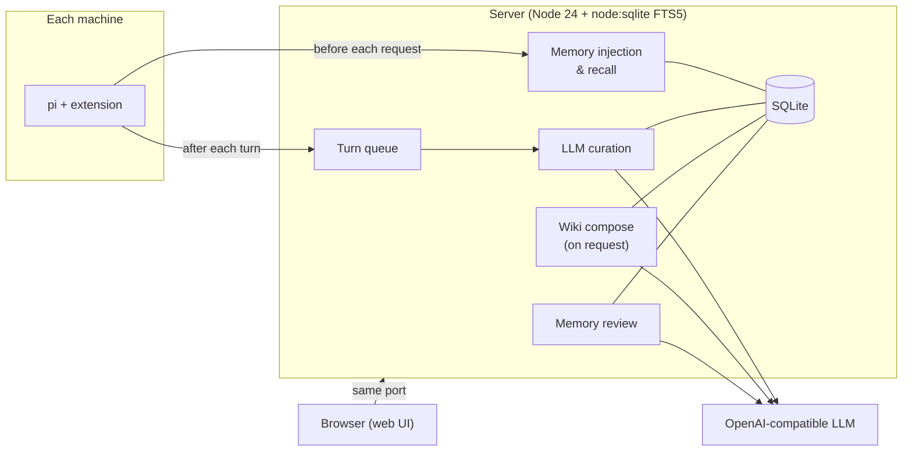

<div align="center">

# memory-wiki-all-you-need

**Central memory + LLM wiki server for the [pi](https://github.com/earendil-works/pi) coding agent.**

[](https://github.com/kht6163/memory-wiki-all-you-need/actions/workflows/ci.yml)
[](https://www.npmjs.com/package/pi-memory-wiki-all-you-need)
[](https://hub.docker.com/r/kht6163/memory-wiki-all-you-need)
[](LICENSE)

**English** | [한국어](README.ko.md)

</div>

<picture>
  <source media="(prefers-color-scheme: dark)" srcset=".github/assets/screenshots/hero-dark.png">
  <source media="(prefers-color-scheme: light)" srcset=".github/assets/screenshots/hero-light.png">
  
</picture>

## What is this?

Memory for pi that lives on **one server** instead of on each machine. Before every request the extension injects your memories into the system prompt — always, not on demand. After each turn the server's LLM reads the conversation and adds, updates or deletes memories on its own. Alongside it sits a **wiki**: a separate document space that humans and agents write, and that the server LLM can compose from your turn history when you ask.

## How it works



## Features

**Memory**
- **Forced injection** — policy, standing instructions, user profile, then project and global memories, within `CONTEXT_BUDGET_CHARS`. The block only changes when memory changes, so the prompt cache survives.
- **Per-prompt recall** — related memories are attached as a hidden `memory-recall` message.
- **Per-turn curation** — the LLM sees related existing memories and returns add / update / edit / delete / confirm; every change is versioned and revertible, and exact duplicates are skipped.
- **Real dates** — "yesterday" is resolved to the day the turn happened (`TIMEZONE`), and each memory records which turns added, edited or confirmed it.
- **Superseded facts** — a new memory can replace an old one via `supersedes`, and `valid_until` expires temporary facts; history stays searchable but is never injected.
- **Semantic search (optional)** — with an embedding server (e.g. [infinity](https://github.com/michaelfeil/infinity) serving `BAAI/bge-m3`), memories and wiki pages are also found by meaning and across languages: a Korean question finds an English memory. Keyword search stays, and the two rankings are fused. If the embedding server is down or slow, search falls back to keywords.
- **Search keywords** — synonyms and translations (`Postgres`, `포스트그레스`) help search and recall without entering the prompt.
- **Curation guidelines** — global and per-project rules for the server LLM, written by humans.
- **Project detection** — the normalized git `origin` URL (`github.com/foo/bar`; worktrees use the main repo), `local/<dir>` without a remote, global-only outside git. Override with `project` in the settings file (or `MEMORY_PROJECT`).

**Graph**
- **Entities and relations** — memories mention entities and link via `because`, `depends_on`, `supersedes`, `related`, decided in the same curation call (no extra LLM call). Entities are shared across projects; renamed or merged names stay as aliases.
- **Graph-aware recall** — boosts results about entities the prompt mentions and adds up to `GRAPH_RECALL_EXTRA` neighbours.
- **Similar-entity suggestions** — "PostgreSQL ↔ Postgres" merge hints from trigram similarity and co-mentions, no LLM.

**Review**
- **Memory review** — the LLM groups memories by entity and *proposes* merges, fixes, deletions and contradictions; nothing changes until you apply. Stale proposals are rejected.
- **Scheduled review** — `REVIEW_EVERY_DAYS` periodically queues proposals for changed scopes.
- **Usage tracking** — recently used memories go first (using only up to yesterday's usage, so the order is stable all day); long-unused ones are listed separately.

**Wiki**
- **Per-project and global wikis** — `[[slug]]` links, `[#id]` memory references, history, revert, backlinks, search, locking.
- **Page tree** — put pages under other pages; collapsible tree, breadcrumbs and a page-tree rail. A flat wiki gets grouping suggestions (e.g. ADRs under their index page) that change nothing until you apply them.
- **Compose from turns** — the LLM turns conversations and tool output into pages, chunked by `WIKI_COMPOSE_CHUNK_CHARS`; never automatic.
- **Wiki lint** — orphan pages, missing links, citations of deleted memories, empty pages (no LLM).

**Web UI**
- Light / dark themes, `⌘K` / `Ctrl K` command palette (with Korean initial-consonant search), keyboard shortcuts (`?`), undo toasts, mobile drawer. Fonts are bundled — no external CDN.

**Safety**
- **Secrets** — secret-looking content is refused on save and masked in turn records.
- **Human-only** — standing instructions and curation guidelines can only be written by humans.
- **Fail-soft** — if the server is down or slow, pi keeps going after a short timeout (`MEMORY_TIMEOUT_MS`), reusing the last memory block it received.
- **Debug mode** — turn it on from the web UI (or `DEBUG_MODE=1`) to collect one JSON-lines file per day under `data/logs/`: requests, why recall picked each memory (keyword score, similarity, graph route), searches, LLM prompts and replies, curation results and embedding calls. Secret-looking strings are masked; files are kept 14 days, at most 200 MB a day.
- **Cancelable jobs** — wiki compose, graph backfill and review jobs can be cancelled and resumed.

## Screenshots

<table>
  <tr>
    <td width="50%"><br><sub><b>Graph</b> — entities and memory relations per project</sub></td>
    <td width="50%"><br><sub><b>Wiki</b> — linked pages with history and backlinks</sub></td>
  </tr>
  <tr>
    <td width="50%"><br><sub><b>Memory</b> — entities, relations, source turn and revision diffs with revert</sub></td>
    <td width="50%"><br><sub><b>Review</b> — LLM proposals with diffs; nothing changes until you apply</sub></td>
  </tr>
  <tr>
    <td width="50%"><br><sub><b>Command palette</b> — <code>⌘K</code> / <code>Ctrl K</code> searches memories, wiki pages and past turns</sub></td>
    <td width="50%"></td>
  </tr>
</table>

## Quick start

### 1. Run the server

The server image is on [Docker Hub](https://hub.docker.com/r/kht6163/memory-wiki-all-you-need) for `linux/amd64` and `linux/arm64`. Tags: `X.Y.Z` (exact release), `X.Y` (latest patch of that minor, e.g. `0.14`), `latest`.

Docker Compose example (put `LLM_API_KEY` in `.env`):

```yaml
services:
  memory:
    image: kht6163/memory-wiki-all-you-need:0.14   # amd64 / arm64
    restart: unless-stopped
    environment:
      LLM_BASE_URL: http://<llm-host>:8317/v1
      LLM_API_KEY: ${LLM_API_KEY:?missing}
      LLM_MODEL: gpt-6-luna
      TIMEZONE: Asia/Seoul
    ports:
      - "127.0.0.1:8765:8765"
    volumes:
      - ./data:/data
```

The container runs as user `node` (uid 1000), so `./data` must be writable by it: `mkdir -p data && sudo chown 1000:1000 data`.

Or with plain `docker run`:

```sh
mkdir -p data && sudo chown 1000:1000 data
docker run -d --name memory-wiki --restart unless-stopped \
  -p 127.0.0.1:8765:8765 -v "$PWD/data:/data" \
  -e LLM_BASE_URL=http://<llm-host>:8317/v1 -e LLM_API_KEY=<key> -e TIMEZONE=Asia/Seoul \
  kht6163/memory-wiki-all-you-need:0.14
```

**Optional: semantic search.** Add an embedding service to the same compose file. bge-m3 is multilingual and runs on CPU (about 55 ms per short query; the model, about 2.3 GB, is downloaded on first start):

```yaml
  embed:
    image: michaelf34/infinity:latest
    command: ["v2", "--model-id", "BAAI/bge-m3", "--engine", "torch", "--port", "7997"]
    restart: unless-stopped
    volumes:
      - ./embed-cache:/app/.cache
```

Then set `EMBED_BASE_URL: http://embed:7997` on `memory`. Existing memories are embedded in the background (`embedPending` in `/api/health`); until then they are still found by keywords.

To build from source instead, replace `image:` with `build: ./memory-wiki-all-you-need` (a clone of this repository).

> [!WARNING]
> There is no login. Bind only to `127.0.0.1` or a network you trust.

Open `http://<server>:8765` for the web UI.

**Upgrading** — back up `data/` first (schema migrations run on startup, and an older server refuses a newer DB, so a backup is your way back), then:

```sh
docker compose pull && docker compose up -d
```

Versions are listed under [tags](https://github.com/kht6163/memory-wiki-all-you-need/tags). Pin `X.Y.Z` if you want to choose when to upgrade.

### 2. Install the pi extension (on each machine)

**Option A — install script** (also saves the server URL in the settings file):

```sh
curl -fsSL http://<server>:8765/install.sh | sh   # → ~/.pi/agent/extensions/memory-wiki-all-you-need
```

**Option B — npm**, then point it at your server once (inside pi):

```sh
pi install npm:pi-memory-wiki-all-you-need
```

```text
/memory-server http://<server>:8765
```

Both save the URL to `~/.pi/agent/extensions/memory-wiki-all-you-need.json` (or under `PI_CODING_AGENT_DIR`), the same place other pi extensions keep their settings. You can also edit the file directly:

```json
{ "serverUrl": "http://<server>:8765" }
```

> [!IMPORTANT]
> Use only one of the two. With both installed, the extension runs twice.

## Configuration

<details>
<summary><b>Server environment variables</b></summary>

| Variable | Default | Description |
|---|---|---|
| `LLM_BASE_URL` | – | OpenAI-compatible `/v1` URL. Unset: turns are stored but not curated |
| `LLM_API_KEY` / `LLM_MODEL` | – / `gpt-6-luna` | |
| `LLM_TIMEOUT_MS` | 180000 | LLM request timeout |
| `PORT` / `HOST` / `DATA_DIR` | 8765 / `0.0.0.0` / `./data` (`/data` in Docker) | |
| `TIMEZONE` | `UTC` | IANA zone used to resolve relative dates |
| `EMBED_BASE_URL` | – | OpenAI-compatible embeddings URL (e.g. `http://embed:7997` for infinity). Unset: keyword search only |
| `EMBED_API_KEY` / `EMBED_MODEL` | – / `BAAI/bge-m3` | Changing the model re-embeds everything |
| `EMBED_QUERY_TIMEOUT_MS` | 700 | Per-request query embedding; slower → keyword-only for that request |
| `EMBED_RECALL_MIN_SIMILARITY` / `EMBED_SEARCH_MIN_SIMILARITY` | 0.55 / 0.45 | Cosine floor for meaning-only matches in recall / search (tuned for bge-m3) |
| `EMBED_QUERY_PREFIX` / `EMBED_DOC_PREFIX` | – | For models that need prefixes (e5: `query: ` / `passage: `) |
| `DEBUG_MODE` | off | `1` keeps debug mode on (otherwise the switch on the web page `#/debug`) |
| `DEBUG_LOG_KEEP_DAYS` / `DEBUG_LOG_MAX_MB` | 14 / 200 | Debug log retention and per-day size cap |
| `CONTEXT_BUDGET_CHARS` | 8000 | System-prompt memory block budget |
| `RECALL_BUDGET_CHARS` / `RECALL_LIMIT` | 3000 / 6 | Per-prompt recall |
| `WIKI_COMPOSE_CHUNK_CHARS` | 40000 | Turn-record chars per compose LLM call |
| `WIKI_COMPOSE_MAX_TURNS` | 200 | Max turns per compose job |
| `WIKI_WRITER_BUDGET_CHARS` | 40000 | Existing page bodies shown per compose call |
| `WIKI_INDEX_BUDGET_CHARS` | 1500 | Wiki page list injected into pi |
| `GRAPH_RECALL_EXTRA` | 4 | Max memories the graph adds to recall |
| `GRAPH_BACKFILL_CHUNK_CHARS` / `GRAPH_BACKFILL_MAX` | 24000 / 2000 | Graph backfill call size / max memories per job |
| `REVIEW_CHUNK_CHARS` / `REVIEW_MAX_ENTRIES` | 24000 / 2000 | Review call size / max memories per job |
| `REVIEW_STALE_DAYS` | 60 | Days without use, injection or edit before a memory counts as stale |
| `REVIEW_EVERY_DAYS` | 0 (off) | Interval for automatic review of changed scopes (proposals only) |

</details>

<details>
<summary><b>Extension settings</b></summary>

`~/.pi/agent/extensions/memory-wiki-all-you-need.json` — every key is optional. Change them inside pi with `/memory-config` (e.g. `/memory-config timeoutMs 3000`, or no arguments to pick from a list) or edit the file. An environment variable with the same meaning overrides the file (handy for a one-off shell).

| Key | Env override | Default | Description |
|---|---|---|---|
| `serverUrl` | `MEMORY_SERVER_URL` | set by the install script or `/memory-server` | Server URL |
| `settleDelayMs` | `MEMORY_SETTLE_DELAY_MS` | 8000 | Wait after the agent settles before sending the turn |
| `timeoutMs` | `MEMORY_TIMEOUT_MS` | 1500 | Timeout for fetching the injected memory |
| `project` | `MEMORY_PROJECT` | (auto) | Override the project key |
| `disabled` | `MEMORY_DISABLED=1` | `false` | Disable the extension (`/memory-config disabled false` turns it back on) |

</details>

## Memory model

| Field | Values |
|---|---|
| `scope` | `global` / `user` / `project` |
| `category` | `standing` `convention` `decision` `fact` `preference` `correction` `failure` `tool-quirk` `insight` |
| `source` | `human` / `llm` / `agent` (last writer) |
| `keywords` | Search-only terms (never injected) |
| `valid_until` | Expiry date `YYYY-MM-DD` (moves to history after) |

## Agent tools & commands

**Tools:** `memory_search`, `session_search`, `memory_add`, `memory_replace`, `memory_remove` (same names and targets as pi-hermes-memory), `memory_graph`, `wiki_search`, `wiki_read`, `wiki_write`.

| Command | What it does |
|---|---|
| `/memory` | Server status and the wiki link for this project |
| `/memory-config [key [value]]` | Show or change any extension setting (no arguments: pick from a list); `/memory-config unset <key>` removes one. Applies right away |
| `/memory-server [url]` | Show the server URL and where it comes from, or save a new one (same as `/memory-config serverUrl <url>`) |
| `/memory-pin <text> [--project]` | Add a standing instruction injected into every session |
| `/memory-flush` | Send the buffered turn now instead of waiting |
| `/wiki-compose [focus]` | Organize this session's turns into the wiki with the server LLM |

## Development

```sh
npm install
npm run dev:server   # :8765 (change with PORT, DATA_DIR)
npm run dev:web      # vite; proxies /api to API_URL (default 127.0.0.1:8765)
npm run typecheck
npm test             # server/test — temp DB + fake LLM per file (node --test)
npm run build        # web UI
```

Requires Node 24 (`node:sqlite`, type stripping; no build step for the server). [GitHub Actions](.github/workflows/ci.yml) runs `npm ci` → typecheck → test → build on every push and PR, plus a Docker image build and headless-Chrome web smoke test.

**Releases** — server, web UI and extension share one version number. Pushing a tag `vX.Y.Z` that matches the `package.json` versions makes [GitHub Actions](.github/workflows/release.yml) publish the server image to Docker Hub (amd64 + arm64). The extension is published to [npm](https://www.npmjs.com/package/pi-memory-wiki-all-you-need) with the same version.

## License

[MIT](LICENSE)
